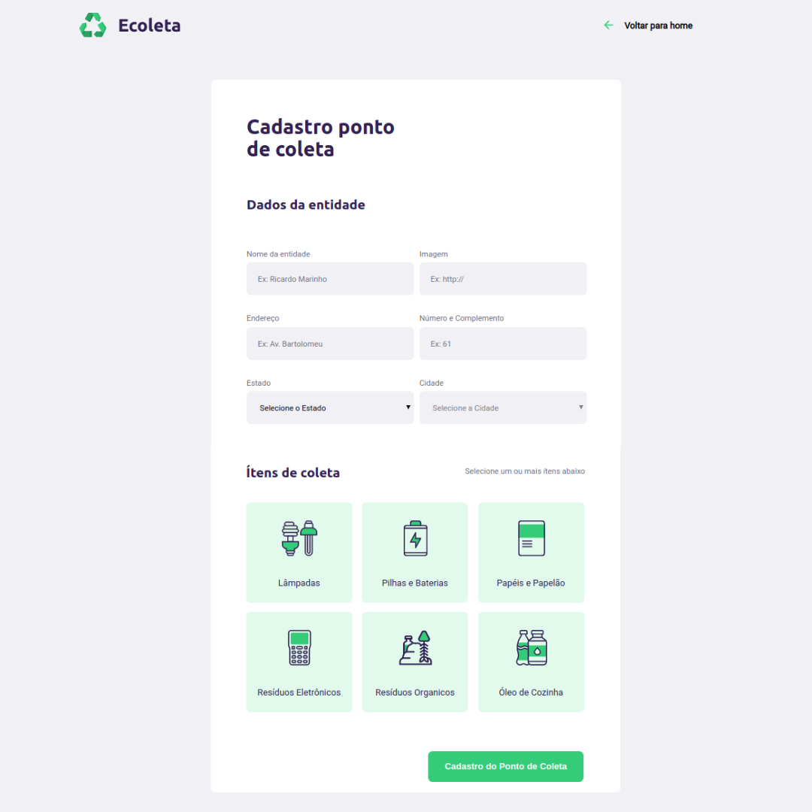
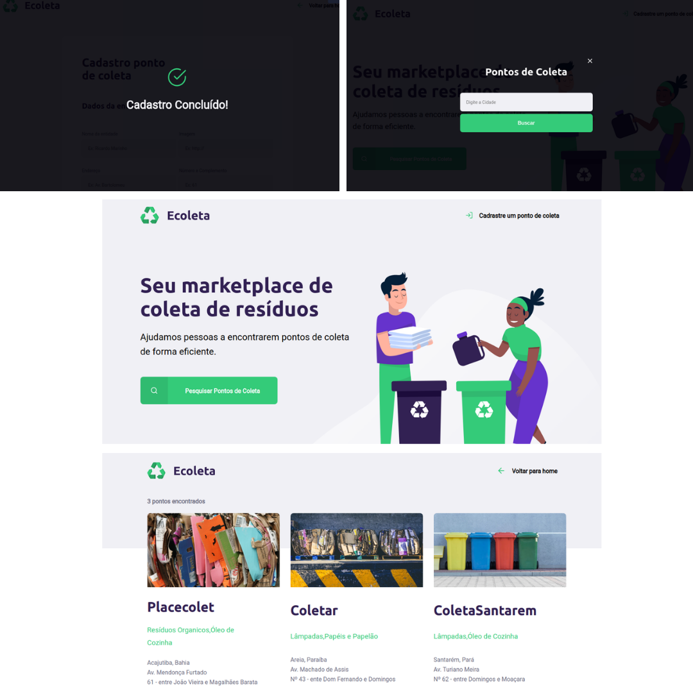

<h1 align="center">
    
</h1>

<h4 align="center"> 
	🚧 NextLevelWeek 1.0 🚀 em construção... 🚧
</h4>

<p align="center">
  
  	
  <a href="https://www.linkedin.com/in/paulo-beckman/">
    
  </a>
	
  
  <a href="https://github.com/paulobeckman/Ecoleta/commits/master">
    
  </a>

  
   <a href="https://github.com/paulobeckman/Ecoleta/stargazers">
    
  </a>
</p>


## 💻 Sobre o projeto

♻️Ecoleta - é uma forma de conectar empresas e entidades de coleta de resíduos orgânicos e inorgânicos as pessoas que precisam descartar seus resíduos de maneira ecológica.

As empresas ou entidades poderão se cadastrar na plataforma web enviando:
- nome da entidade
- uma url de uma imagem do ponto de coleta
- endereço com número e complemento
- e selecionar o estado e a cidade
- além de selecionar um ou mais ítens de coleta: 
  - lâmpadas
  - pilhas e baterias
  - papéis e papelão
  - resíduos eletrônicos
  - resíduos orgânicos
  - óleo de cozinha


Projeto desenvolvido durante a **NLW - Next Level Week** oferecida pela [Rocketseat](rs).
O NLW é uma experiência online com muito conteúdo prático, desafios e hacks onde o conteúdo fica disponível durante uma semana.


## 🎨 Layout

O layout da aplicação está disponível no Figma:

<a href="https://www.figma.com/file/1SxgOMojOB2zYT0Mdk28lB/Ecoleta?node-id=136%3A546">
  
</a>


### Web

<p align="center" style="display: flex; align-items: flex-start; justify-content: center;">
  

  
</p>

## 🛠 Tecnologias

As seguintes ferramentas foram usadas na construção do projeto:

- [Node.js][nodejs]
- [CSS][css]
- [HTML][HTML]
- [JavaScript][JavaScript]
- [SQLite][SQLite]
- [Nunjucks][Nunjucks]


## 🚀 Como rodar este projeto

Podemos considerar este projeto como sendo divido em três partes:
1. Back End (arquivos server.js, routes.js e pasta public) 
2. Front End (pasta views)

💡O Front End precisa que o Back End esteja sendo executado para funcionar.

### Pré-requisitos

Antes de começar, você vai precisar ter instalado em sua máquina as seguintes ferramentas:
[Git](https://git-scm.com), [Node.js][nodejs]. 
Além disto é bom ter um editor para trabalhar com o código como [VSCode][vscode]

### 🎲 Rodando o Back End (servidor) e a aplicação web (Front End)

```bash
# Clone este repositório
$ git clone https://github.com/paulobeckman/Ecoleta.git

# Acesse a pasta do projeto no terminal/cmd
$ cd Ecoleta

# Vá para a pasta server
$ cd server

# Instale as dependências
$ npm install

# Execute a aplicação em modo de desenvolvimento
$ npm start

# O servidor inciará na porta:3000 - acesse http://localhost:3000 
```


## 📝 Licença

Este projeto esta sobe a licença MIT. Veja a [LICENÇA](license) para saber mais.

Feito por Paulo Beckman 👋🏽 [Entre em contato!](https://www.linkedin.com/in/paulo-beckman/)

[nodejs]: https://nodejs.org/
[yarn]: https://yarnpkg.com/
[vscode]: https://code.visualstudio.com/
[vceditconfig]: https://marketplace.visualstudio.com/items?itemName=EditorConfig.EditorConfig
[license]: https://opensource.org/licenses/MIT
[vceslint]: https://marketplace.visualstudio.com/items?itemName=dbaeumer.vscode-eslint
[prettier]: https://marketplace.visualstudio.com/items?itemName=esbenp.prettier-vscode
[rs]: https://rocketseat.com.br>
[CSS]: https://developer.mozilla.org/pt-BR/docs/Web/CSS
[HTML]: https://developer.mozilla.org/pt-BR/docs/Web/HTML
[JavaScript]: https://developer.mozilla.org/pt-BR/docs/Aprender/JavaScript
[SQLite]: https://www.sqlitetutorial.net/sqlite-nodejs/
[Nunjucks]: https://www.npmjs.com/package/nunjucks

